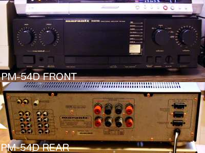
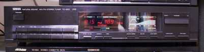
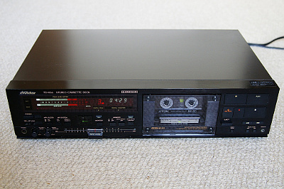
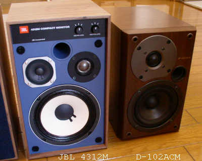
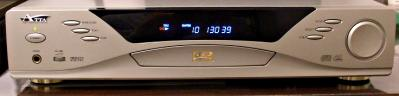
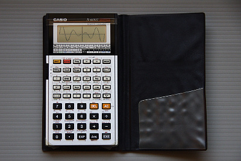

<!-- HTML本文ここから（貼付ここから） -->
# [Historical Manuals Archive] 古い機器のマニュアル保管場 

[Home](../index.html) > [Software](./index.html) > [ソフトウエア開発・サーバ管理のメモ帳](../../software/software_server_memo.html) > this page

last update 2013/02/07

 
 

製造終了後かなりの年数が経ち、メーカーのホームページで仕様やマニュアル類が全く提供されていない製品のマニュアルを保存しています。紙マニュアルをスキャナで読み取りPDF化しています。 

###  Marantz(Japan) Amplifier PM-54D / 日本マランツ プリメインアンプ PM-54D 

**[取扱説明書(Google Drive)を見る](https://drive.google.com/file/d/0B7BSijZJ2TAHOGRiM2FiZTEtOGU5Ny00MTQ1LTk3NDAtOWEzOGRmYjUwYjU4)**

1987年頃の製品

- 定格出力 80W*2 (8 ohm)
- 出力周波数帯域 5kHz - 50kHz
- 消費電力 120W
- 質量 9.5kg
- 外形寸法 416 * 136 * 376mm 

 
 

### YAMAHA AM/FM Tuner TX-500 / ヤマハ AM/FM チューナー TX-500

**[取扱説明書(Google Drive)を見る](https://drive.google.com/file/d/0B7BSijZJ2TAHZjA0MjFmMjktMTEyNC00ZWM0LWIxM2EtMjZiMjc0YTZkMjQ2)**

1987年頃の製品

- 受信周波数 530kHz - 1610kHz (AM) / 76.0MHz - 90.0MHz (FM)
- SN比 50dB (AMモノラル) / 76dB (FMステレオ), 80dB (FMモノラル)
- 消費電力 10W
- 質量 3.1kg
- 外形寸法 435 * 92.5 * 282.5mm 

 
 

### VICTOR CASSETTE DECK TD-V66 / ビクター カセットデッキ TD-V66

**[取扱説明書(Google Drive)を見る](https://drive.google.com/file/d/0B7BSijZJ2TAHNmZjMzdhZjMtZDM1Yy00ZGM1LTkwYTktYTgyZWY1ZTc1MGNh)**

1987年頃の製品

- ヘッド 消去, 録音, 再生 (3ヘッド式)
- モーター キャプスタン・リール用, FF/REW用, メカニズム駆動用 (各1個)
- 周波数特性 20Hz-21kHz(メタル), 20Hz-19kHz(クローム), 20Hz-19kHz(ノーマル) (@-20dB録音)
- SN比 54dB(メタル, DOLBY NR OFF)
- 消費電力 18W
- 質量 4.8kg
- 外形寸法 435 * 110 * 282mm 

 
 

### ONKYO SPEAKER D-102ACM / オンキョー スピーカー D-102ACM

**[取扱説明書(Google Drive)を見る](https://drive.google.com/file/d/0B7BSijZJ2TAHY2E1OGEwZWYtNjE0ZS00NjNhLWE2ZmItMGQ5ZmFmNzAwZWRj)**

1998年頃23,000円で購入した製品

- 方式 2ウェイ・バスレフ式
- インピーダンス 4 ohm
- 最大入力 80W
- 再生周波数 50Hz - 35kHz
- 出力音圧 89dB
- 質量 5.3kg
- 外形寸法 166 * 259 * 272mm 

 
 

### ATTA DVD PLAYER DVD-838 / ATTA DVDプレーヤ DVD-838

**[取扱説明書(Google Drive)を見る](https://drive.google.com/file/d/0B7BSijZJ2TAHYTFmNzkwNGEtNDk5MC00ZDJkLWE1NmUtMWU1MTlmNzA3YzQy)**

2000年頃30,000円で購入した製品。海外のDVDを再生できるジャンク品として販売されていました。

- 対応メディア DVD, DVD-R, CD, CD-R, CD-RW
- 再生可能フォーマット DVD, VCD, SVCD, CD(Audio), CD(MP3), CDI-FMV
- 対応映像方式 MPEG2, MPEG1
- 対応音声方式 MPEG1 Layer1/2, Standard LPCM, AC3, MPEG2
- 出力端子（映像） コンポジット, S
- 出力端子（音声） 同軸デジタル, 光デジタル, 5.1chアナログ, 2chアナログ, ヘッドホン
- 再生周波数（音声） 4Hz-20kHz(CD), 4Hz-22kHz(48kHzサンプリング), 4Hz-44kHz(96kHzサンプリング)
- SN比 90dB
- 消費電力 25W
- 質量 -
- 外形寸法 430 * 320 * 90mm 

 
 

###  CASIO Programmable Scientific Calculator fx-6500G / カシオ プログラム関数電卓 fx-6500G

**[操作マニュアル(Google Drive)を見る](https://drive.google.com/file/d/0B7BSijZJ2TAHOWNlNTFjZDItZDU3Ny00MTgxLWE1YjQtZGQ0N2YzOTJmOTFj)**

**[アプリケーションブック(Google Drive)を見る](https://drive.google.com/file/d/0B7BSijZJ2TAHMWQwNTVmZWUtYjE2Yi00ZDM0LWFkNzMtNDQwMTMzMTQ4MDIw)**

1986年頃の製品

- 機能 基本計算・関数計算・統計計算、任意の関数・統計グラフ描画
- 画面 数値表示、文字表示（最大64文字）、グラフィック
- プログラム 486ステップ、最大10組
- ジャンプ 10対(無条件goto), 9組(条件ジャンプ、サブルーチン)
- 電源 リチウム電池CR-2032C *3個（電池寿命 130時間）
- 消費電力 0.03W
- 質量 127g(6500G), 124g(6000G)
- 外形寸法 80 * 148.5 * 11.5mm (6500G), 81 * 150 * 21mm (6000G) 

 
 

###  松下電器 オーブンレンジ NE-M620

**[取扱説明書(Google Drive)を見る](https://drive.google.com/file/d/0B7BSijZJ2TAHOTZnODEtLWYweFU/view?usp=sharing&resourcekey=0-h_cTHrG6ap9gkO1_45Wvug)**

1986年頃の製品

- 電子レンジ 600W（強）, 180W（弱）, 消費電力 最大 1.12kW
- オーブン 1.2kW（ヒーター出力）, 温度調整範囲 110〜250℃
- グリル 1.2kW（ヒーター出力）
- 外形寸法 520 W * 403 D * 342 H
- 庫内寸法 322 W * 340 D * 195 H （ターンテーブル直径 290）
- 質量 25kg（60Hz） 

 
 
 
 
<!-- HTML本文ここまで（貼付ここまで） -->